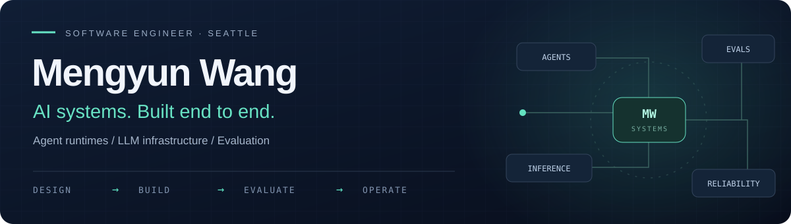

  <picture>
    <source media="(max-width: 600px)" srcset="assets/profile-banner-mobile.svg" />
    
  </picture>

  
  
  
  

<a href="#-selected-work">Selected work</a> · <a href="#-toolkit">Toolkit</a> · <a href="#-writing--current-focus">Writing &amp; current focus</a>

### 👋 A little about me

I'm a Software Engineer at Meta, based in Seattle, WA — I build **infrastructure for large-scale AI systems and LLM agents**: distributed data systems, agent runtimes and harnesses, retrieval, sandboxed execution, and evaluation harnesses.

The through-line is reliability under real load: an agent is only useful once you can show what it did, prove the answer came from the authoritative source, and catch the run where it goes wrong.

 

### 🚀 Selected work

<table>
<tr>
<td width="50%" valign="top">
<h3>🤝 Atlas</h3>

MULTI-AGENT EXECUTION

Five specialist agents, human approval gates, durable task state, distributed workers, and Docker-isolated tools.

<strong>52 tests · Full-stack CI</strong>

<code>FastAPI</code> <code>PostgreSQL</code> <code>Redis</code> <code>Celery</code>

<a href="https://github.com/xiyiji/atlas-llm-execution-agent">Explore repository ↗</a> · <a href="https://xiyiji.github.io/projects/atlas-demo.html">Mission control</a>

</td>
<td width="50%" valign="top">
<h3>🧵 Loomwork</h3>

DURABLE AGENT RUNTIME

Crash recovery, context compaction, hybrid retrieval with reranking, and an isolated execution environment.

<strong>104 tests · 67 retrieval evaluation questions</strong>

<code>Python</code> <code>SQLite</code> <code>ONNX Runtime</code> <code>Next.js</code>

<a href="https://github.com/xiyiji/loomwork">Explore repository ↗</a>

</td>
</tr>
<tr>
<td width="50%" valign="top">
<h3>🔁 mini-harness</h3>

CODING-AGENT HARNESS

Typed tools, read-before-write gating, sandboxed execution, subagents, and resumable benchmark runs.

<strong>24 / 25 exercises solved · Polyglot benchmark subset</strong>

<code>Python</code> <code>Pydantic</code> <code>Docker</code> <code>Textual</code>

<a href="https://github.com/xiyiji/mini-harness">Explore repository ↗</a>

</td>
<td width="50%" valign="top">
<h3>⚙️ LLM Serving Platform</h3>

INFERENCE INFRASTRUCTURE

OpenAI-compatible streaming, latency-aware routing, micro-batching, warm pools, and canary releases.

<strong>Canary auto-rollback · Next.js operations console</strong>

<code>FastAPI</code> <code>Next.js</code> <code>Prometheus</code> <code>Docker</code>

<a href="https://github.com/xiyiji/llm-serving-platform">Explore repository ↗</a> · <a href="https://llm-serving-platform.vercel.app">Live console</a>

</td>
</tr>
<tr>
<td width="50%" valign="top">
<h3>🤖 Delivery Exception Agent</h3>

AGENTIC OPERATIONS

Retrieves operational playbooks with page-level citations, diagnoses shipment exceptions, and routes human approvals.

<strong>10 / 10 evaluated exceptions · 8 / 8 escalations</strong>

<code>LangGraph</code> <code>LangSmith</code> <code>Chroma</code> <code>OpenAI API</code>

<a href="https://github.com/xiyiji/delivery-exception-agent">Explore repository ↗</a>

</td>
<td width="50%" valign="top">
<h3>🧪 LLM Gateway</h3>

MODEL ROUTING &amp; EVALUATION

Four routing policies behind one interface, from rules to PPO, evaluated on quality, cost, and latency.

<strong>46-task benchmark · Three verification regimes</strong>

<code>Python</code> <code>FastAPI</code> <code>PyTorch</code> <code>SQLite</code>

<a href="https://github.com/xiyiji/llm-gateway">Explore repository ↗</a>

</td>
</tr>
</table>

<strong>Explore my engineering focus</strong>

### What I build

- 🤖 **Production LLM agents on LangGraph** — an operations agent that diagnoses exceptions over live data, cites the playbook page it applied, and escalates to a human when it should: **10/10 tasks, 8/8 escalations, none raised unnecessarily** (Delivery Exception Agent)
- 🔁 **Coding-agent harness** — typed tools, read-before-write gating, Docker sandbox, subagents, context compaction; **96% on a 25-exercise polyglot benchmark subset** (mini-harness)
- 🧵 **Durable agent runtime** — an event journal that lets a run **resume after `kill -9` with exactly-once effects**, a context budget that shrinks, summarises and pins, hybrid retrieval with reranking, and a namespace + cgroup sandbox that **held against 13 escape attempts** (Loomwork)
- 🧪 **Evaluation harnesses with regression gates** — recorded baselines re-scored in CI without an API key, deterministic scoring, LLM-as-judge reported but never gating; the harness is built first and the behaviour is changed against it (Loomwork · LLM Gateway · GroundTruth)
- 🤝 **Production-grade multi-agent execution** — designed and built a five-agent LLM platform with deterministic risk policy, atomic human approvals, durable crash recovery, distributed workers, transactional audit events, Docker-isolated tools, and real-time SSE operations; **52 tests + full-stack CI** (Atlas)
- ⚙️ **LLM serving infrastructure** — an OpenAI-compatible inference gateway with adaptive routing, dynamic batching, prefix caching and canary releases, paired with a Ray Serve + vLLM engine layer (LLM Serving Platform · InferenceGateway)
- 🚀 **Deployable ML services** — FastAPI · Docker · CI, with leakage-safe features and cost-aware model selection (Cognitive Shorts)
- 📚 **Interview-prep tooling** — a daily-updated question bank for ML engineers with reference answers and built-in AI walkthroughs (MLE Prep)

<strong>All projects · Benchmarks, implementation details &amp; full technology stacks</strong>

### Featured projects

| Project | What it does | Stack |
|---|---|---|
| [Delivery Exception Agent](https://github.com/xiyiji/delivery-exception-agent) | A **LangGraph** multi-agent assistant for last-mile delivery operations: it reads shipment logs and a customer SQL database, retrieves the operations playbook with **page-level citations**, drafts the customer message, and decides whether a human has to approve it. **10 of 10 exceptions resolved end to end, 8 of 8 escalations correct with none raised unnecessarily, tool-call accuracy 10/10, answer coherence 5.0/5**, ~6 s per exception. Guardrails ahead of every side effect — an execution gate on status and send permission, PII redaction on traces and judge inputs — and a documented ground-truth-vs-playbook conflict rather than a quiet rewrite. `8 offline tests` · CI | Python · LangGraph · LangSmith · Chroma · SQLite · OpenAI API |
| [mini-harness](https://github.com/xiyiji/mini-harness) | A coding-agent harness in ~1,800 lines of Python: **nine Pydantic-typed tools**, **read-before-write gating** on every edit, a **no-network Docker sandbox**, subagents, context compaction, request retries and a Textual TUI. **Solves 24 of 25 exercises (96%)** from Aider's polyglot benchmark with claude-haiku-4-5 — Python 12/12, Go 11/12 — scored by each exercise's own test suite. Per-task turn cap, resumable benchmark driver. `16 offline tests` · fake model server · CI on Python 3.12–3.13 | Python · Pydantic · OpenAI SDK · Docker · Textual · pytest |
| [Loomwork](https://github.com/xiyiji/loomwork) | A durable agent runtime. An append-only SQLite journal lets a run **resume after `SIGKILL` with exactly-once side effects** — the test kills a real child process mid-run and counts twelve effects, not thirteen. Context compaction that shrinks, summarises and pins keeps a step-3 fact alive through a 40-step run on a 4k-token budget. Structure-aware chunking + BM25 + embeddings + RRF + cross-encoder rerank, judged on **67 real vLLM issue-tracker questions** against the maintainers' own answers: **R@5 0.51 vs 0.43** for keyword search. A bubblewrap + cgroup sandbox that **held against 13 escape attempts** (fork bomb, `/etc/shadow`, network, symlinks…). Two agents on it, 22 eval tasks, a **committed baseline re-scored in CI behind a regression gate**, no API key needed. MCP server over the tools; Next.js trace viewer. `104 tests` · CI | Python · SQLite · bubblewrap · cgroups · ONNX Runtime · FastMCP · Next.js |
| [Atlas](https://github.com/xiyiji/atlas-llm-execution-agent) ([mission control](https://xiyiji.github.io/projects/atlas-demo.html)) | An end-to-end **multi-agent LLM execution platform** that separates probabilistic reasoning from deterministic control. I designed the orchestrator and five-agent committee, merged model risk with a policy floor, and made consequential work wait on an **atomic human approval**. PostgreSQL persists the task state machine and audit sequence; Redis + Celery provide distributed execution, locks and cross-replica event delivery; generated code runs in a locked-down Docker sandbox. Crash recovery resumes from the last completed step, strict Pydantic contracts reject malformed verifier output, and SSE combines snapshots, SQL replay and live Pub/Sub. `52 tests` · authenticated full-stack CI across API, worker, PostgreSQL, Redis, Alembic and sandbox. | Python 3.12 · FastAPI · Pydantic · PostgreSQL · SQLAlchemy · Alembic · Redis · Celery · Docker · Prometheus · SSE · GitHub Actions |
| [LLM Gateway](https://github.com/xiyiji/llm-gateway) | Model routing improved against a graded benchmark: **46 tasks across three verification regimes** (exact-match math, sandboxed code, model-graded QA) with a cached result set, so every change to decision logic is scored on the same suite before it ships. Four generations of policy behind one interface — rules, a weighted score, logistic regression, and a from-scratch **PPO policy optimising quality − λ·cost** — hot-swappable at runtime. The learned policy held multi-step agent accuracy while **cutting cost 67% and latency 42%**; on held-out evals, **100% of large-model quality at 48% of the cost**, 803 RPS at P95 80 ms. | Python · FastAPI · PyTorch · SQLite |
| [LLM Serving Platform](https://github.com/xiyiji/llm-serving-platform) ([live demo](https://llm-serving-platform.vercel.app)) | A self-hosted serving layer for LLM inference: OpenAI-compatible gateway with SSE streaming, latency-aware routing, dynamic micro-batching, prefix caching (**94.7%** hit rate under repeated-prompt load), warm-pool cold-start management, canary releases with **auto-rollback**, and a Next.js ops console. Pairs with [InferenceGateway](https://github.com/xiyiji/InferenceGateway) (Ray Serve + vLLM) as the engine layer. `27 tests` · CI · Docker/K8s/Terraform | Python · FastAPI · Next.js · TypeScript · Prometheus |
| [Cognitive Shorts](https://github.com/PSCRedefine) | An engagement-prediction model taken from notebook to four deployable services: [Single Prediction](https://github.com/PSCRedefine/SinglePrediction) · [Batch Prediction](https://github.com/PSCRedefine/BatchPrediction) · [Model Info](https://github.com/PSCRedefine/ModelInfo) · [Analytics Dashboard](https://github.com/PSCRedefine/AnalyticsDashboard). Four candidates finished statistically tied, so operating cost broke the tie — the shipped artefact is **1,958× smaller** and 35× faster than the runner-up. `292 tests` · CI on Python 3.11–3.13 | Python · FastAPI · Docker · scikit-learn |
| [GroundTruth](https://github.com/PSCRedefine/groundtruth) | Unbiased offline evaluation on real Kuaishou short-video logs (2.6M interactions). Ranking survives the exposure shift almost intact; calibration collapses — the model is **2×** as confident as reality on traffic it did not select. Every figure reproduces from a committed JSON artefact. `ROC-AUC 0.8811` | Python · pandas · scikit-learn · LightGBM |
| [MLE Prep](https://mle-prep-pi.vercel.app/) ([source](https://github.com/xiyiji/mle-prep)) | A growing machine-learning-engineer interview question bank, updated daily: 360+ questions across ML coding, theory, LLMs & agents, ML systems, MLOps, recommender systems, AI safety, multimodal and behavioural, filterable by category and difficulty. Reference answers give an answer framework, key points, common follow-ups and further reading, and any question can be handed to Claude or ChatGPT for a walkthrough. In Chinese. | HTML · JavaScript · KaTeX · Vercel |

How each of these was built, and what broke along the way: xiyiji.github.io/blogs.

 

### 🛠 Toolkit

LANGUAGES &amp; ML

  
  
  
  

AGENTS &amp; BACKEND

  
  
  
  

INFRASTRUCTURE &amp; OBSERVABILITY

  
  
  
  

<strong>Full toolkit by discipline</strong>

### Tech stack

**LLM & agents**
`LangGraph` `LangChain` `LangSmith` `agent runtime` `agent harness` `tool calling` `MCP` `multi-agent orchestration` `prompt engineering` `context compaction` `guardrails & execution gates` `event sourcing / replay` `sandboxed execution (bubblewrap · cgroups · Docker)` `RAG` `Chroma` `BM25` `embeddings` `RRF fusion` `cross-encoder reranking` `citation-grounded answers` `model routing` `Anthropic API` `OpenAI API` `vLLM` `Ray Serve` `ONNX Runtime`

**Evaluation**
`eval harnesses` `golden datasets` `automated graders` `regression gates` `replayable eval runs` `LLM-as-judge` `polyglot benchmark` `trajectory-level failure analysis` `offline evaluation` `off-policy evaluation (IPS / SNIPS / DR)` `paired bootstrap` `calibration`

**ML & data**
`PyTorch` `Hugging Face` `scikit-learn` `LightGBM` `pandas` `NumPy` `DuckDB` `Parquet` `two-tower rankers` `PPO` `fine-tuning data curation`

**Backend & distributed systems**
`Python` `Java` `C++` `FastAPI` `gRPC` `Spring Boot` `Kafka` `Redis Streams` `stream processing` `exactly-once delivery` `idempotency` `PostgreSQL` `MySQL` `SQLite` `Celery` `SSE`

**Serving & operations**
`AWS` `Docker` `Kubernetes` `Terraform` `canary / staged rollout` `Prometheus` `Grafana` `OpenTelemetry` `pytest` `GitHub Actions` `uv`

**Web**
`TypeScript` `Next.js` `Textual` `Vercel` `GitHub Pages`

 

### ✍️ Writing & current focus

I write about what I actually build.
 
- 📚 [All posts](https://xiyiji.github.io/blogs/) — daily notes on AI engineering learning.

---

**Currently**

- 🔨 Building: [MLE Prep](https://mle-prep-pi.vercel.app/) — new questions and reference answers added daily
- 📖 Writing: daily notes on AI engineering and evaluation

 

Agent systems · Inference infrastructure · Evaluation

